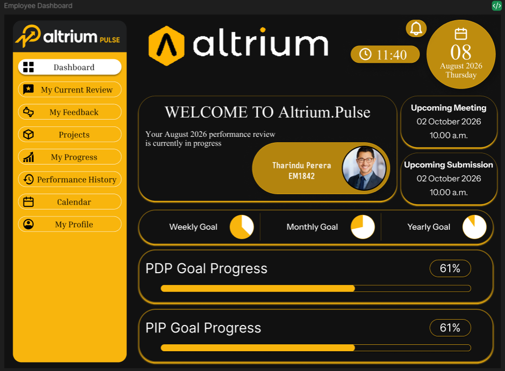
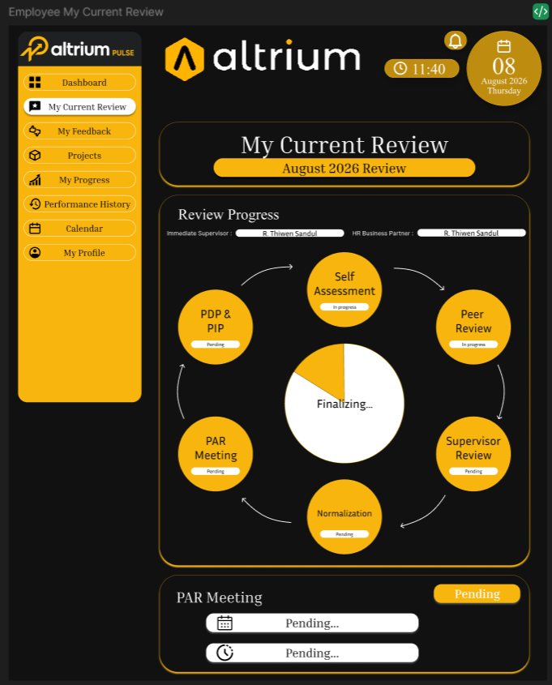
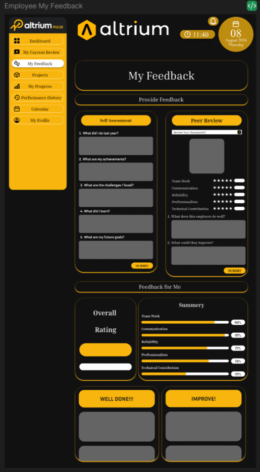
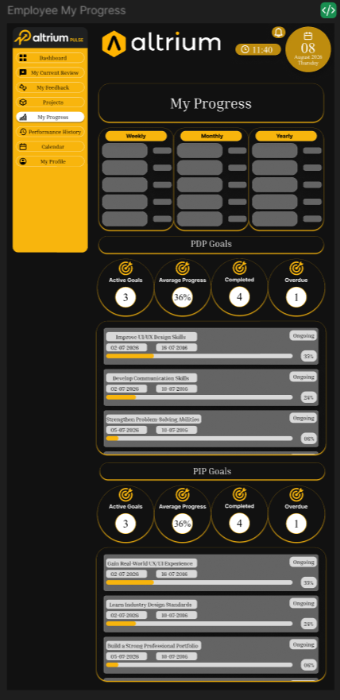
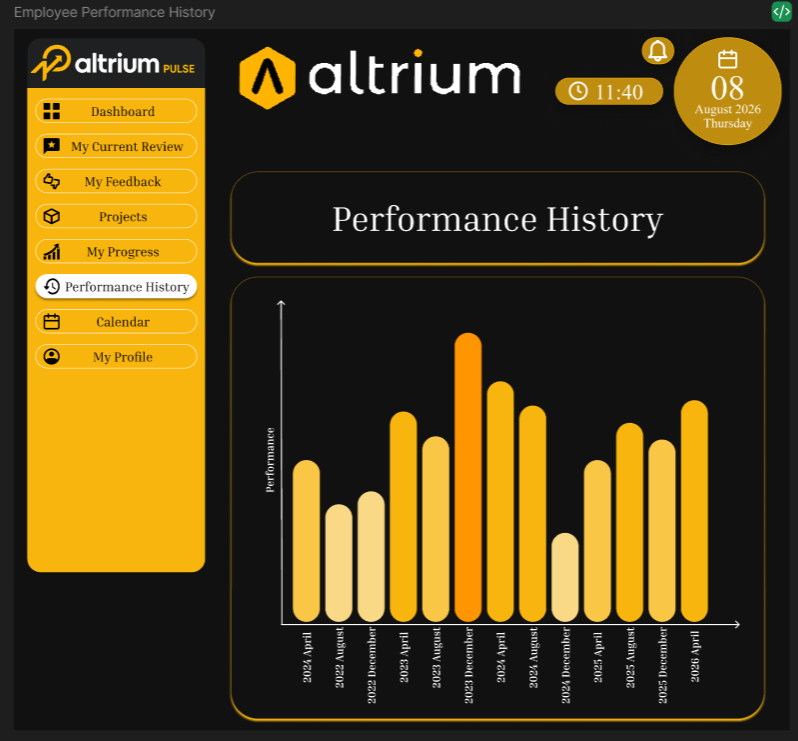
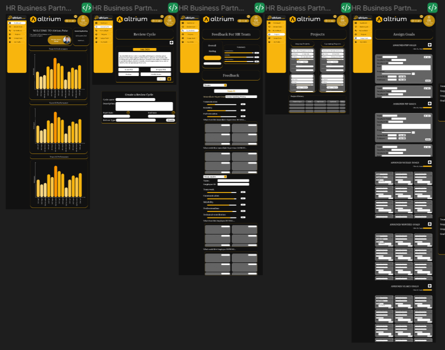
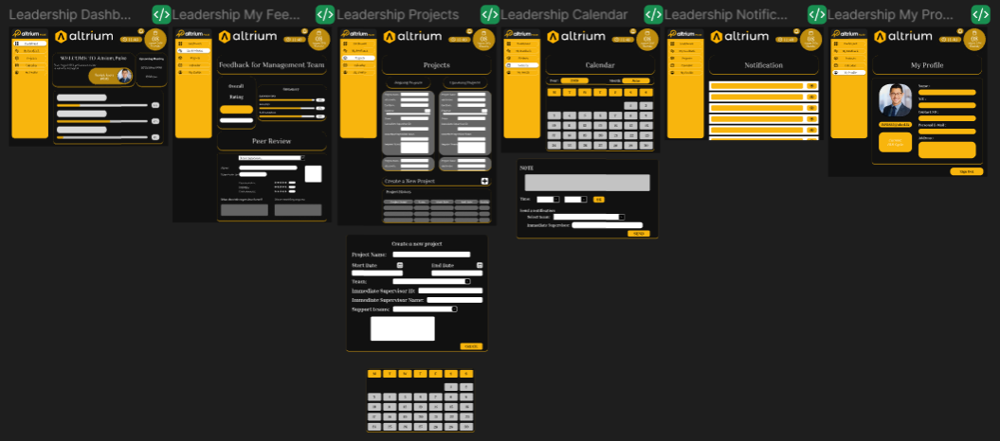
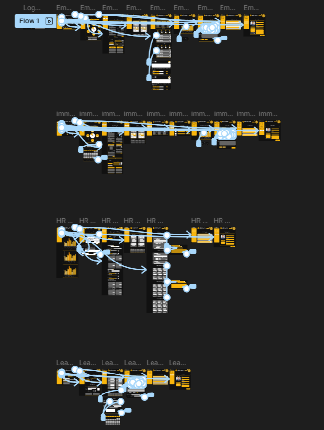

# Altrium.Pulse – Employee Performance & Development Platform

## Overview

Altrium.Pulse is an employee performance and development platform designed to support performance reviews, continuous feedback, goal tracking, and employee development.

The platform provides different experiences for employees, immediate supervisors, HR Business Partners, and leadership, allowing performance information and development activities to be managed throughout the review cycle.

## Project Type

UX/UI Design Project

## My Role

I contributed to the project as a:

- Business Analyst during Sprint 1
- UX/UI Designer throughout the project
- Client requirements analyst and communicator
- Figma UI designer and prototyping contributor

My responsibilities included analysing client requirements, communicating with the client, identifying user needs, designing user flows and interfaces, creating prototypes, and improving the design based on feedback.

## Users & Roles

The platform supports multiple roles with different responsibilities:

### Employee

Employees can:

- View their performance dashboard
- Access their current review cycle
- Provide and receive feedback
- Track their progress and development goals
- Manage PDP (Personal Development Plan) goals
- View their performance history

### Immediate Supervisor

The Immediate Supervisor plays an important role in the employee performance review process.

They can:

- Review employee performance
- Provide feedback to employees
- Monitor employee progress
- Review development goals
- Support PDP and PIP progress
- Participate in the employee's performance review cycle

### HR Business Partner

HR Business Partners can:

- Monitor employee performance activities
- Manage and monitor review cycles
- Support performance and development processes
- Review feedback and performance information
- Support HR-related performance management activities

### Leadership

Leadership users can access higher-level performance information to monitor organizational performance and employee development.

## Key Features

### Employee Dashboard

Provides employees with an overview of their current performance activities, review status, feedback, and development progress.

### Current Review Cycle

Allows employees to view and participate in their current performance review cycle.

### Feedback

The feedback section supports both giving and receiving feedback, helping create a continuous feedback process between employees and their supervisors and colleagues.

### My Progress

Allows employees to track their professional development and progress toward their goals.

### PDP & PIP Goals

The platform supports:

- Personal Development Plan (PDP) goals
- Performance Improvement Plan (PIP) goals
- Goal progress tracking
- Development activities

### Performance History

Employees can review their previous performance information and track their development over time.

### Review Cycle Management

Supports the management and monitoring of employee performance review cycles.

## UX/UI Design Process

The project involved:

1. Understanding client requirements
2. Analysing user needs and roles
3. Defining system requirements and user flows
4. Creating wireframes and interface concepts
5. Designing the UI in Figma
6. Creating interactive prototypes
7. Gathering feedback
8. Iterating and improving the design

## Tools & Technologies

- Figma
- Figma Prototyping
- Figmotion
- UML
- UX/UI Design

## Screenshots

### Employee Dashboard

### Employee – My Current Review Cycle

### Employee – Feedback

### Employee – My Progress

### Employee – Performance History

### HR Business Partner Screens

### Leadership Screens

### Interactive Prototype

## Figma File

The original Figma design file is included in the `Figma` folder.

**File:** `Altrium.Pulse.fig`

### Disclaimer

This project was created as part of an academic group project. The screens and information presented in this repository are for educational and portfolio purposes.
